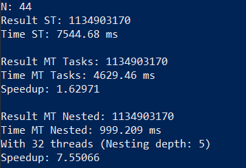

# Exercises OMP2

num_threads was set to 24 for all benchmarks.

# Fibonacci

Parallelization of the calculation fibonacci numbers was more effective using nested parallelism than using tasks in my case. Using tasks is useful for example for unevenly distributed workloads, but at the same time introduces some lot overhead (task creation, task distribution, task management). Nested parallelism using sections avoids this overhead, which in this case is very useful because the recursive calculation of fibunacci numbers is a rather evenly distributed workload, so there is no benefit in using the task construct over sections.

